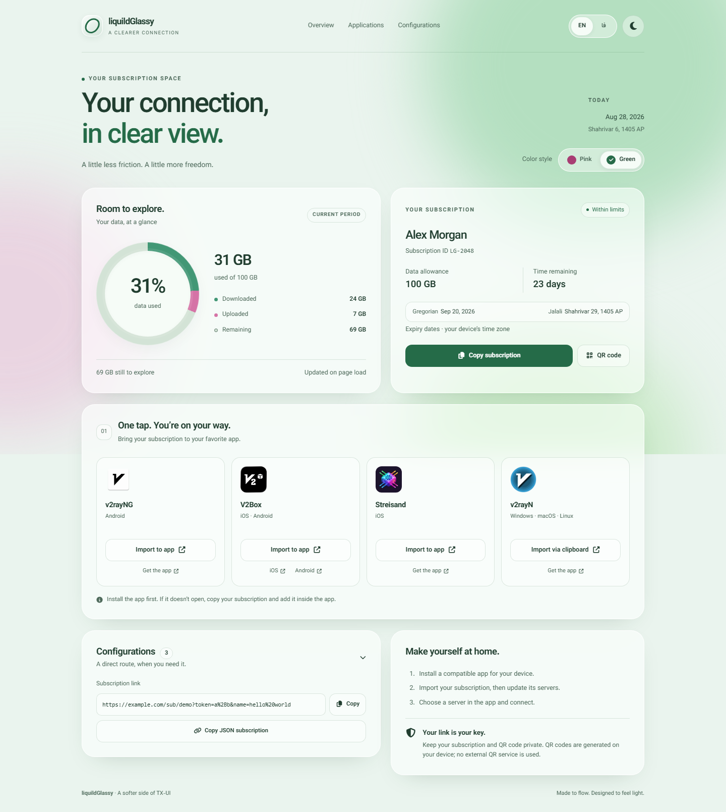
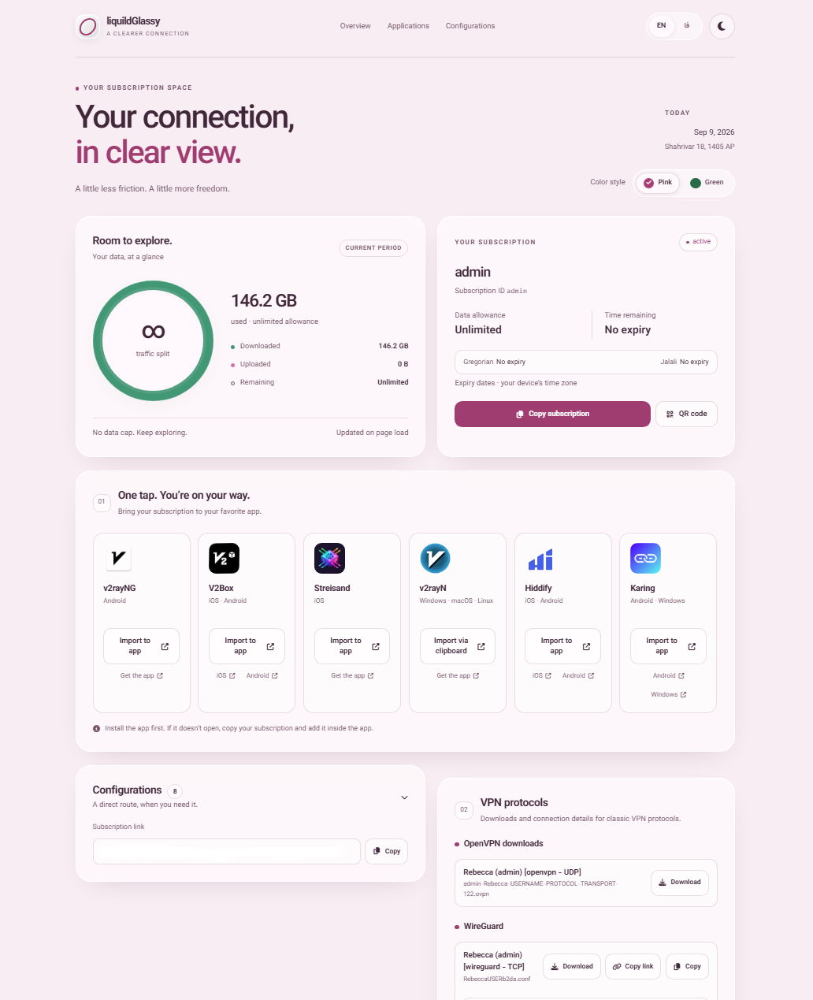
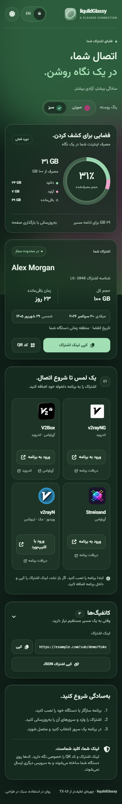

# LiquildGlassy for Rebecca

Custom subscription page templates for **TX-UI / Rebecca Panel**, designed by the TX Community.

## Quick Install

Install a pre-designed subscription theme with one command:

```bash
bash <(curl -Ls https://raw.githubusercontent.com/im-https/liquildGlassy-for-Rebecca/main/install.sh)
```

## Supported Languages

* 🇬🇧 English — Default
* 🇮🇷 فارسی

## Supported Protocols

The subscription templates can be used with services supporting:

* VMess
* VLESS
* OpenVPN
* WireGuard
* L2TP/IPsec
* PPTP
* IKEv2
* AnyConnect
* SSH

## Installation

1. Create your custom HTML template and name it , Then open (https://github.com/im-https/liquildGlassy-for-Rebecca/blob/main/themes/index.html)[this link] and copy the code:

```text
index.html
```

2. Copy it to:

```text
/var/lib/rebecca/templates/subscription
```

3. Open the panel settings.

4. Go to **Settings**, then **Subscriptions**, and in the **Custom templates directory**, type /var/lib/rebecca/templates.

5. Save the settings and restart the panel service.

Your custom subscription page should now be displayed instead of the default page.

## Themes

### liquildGlassy — Green / English / Light



### liquildGlassy — Pink / English / Light



### liquildGlassy — Green / فارسی / Dark / Mobile



## Credits

Designed by **[Incognito-Coder](https://github.com/Incognito-Coder)**.
